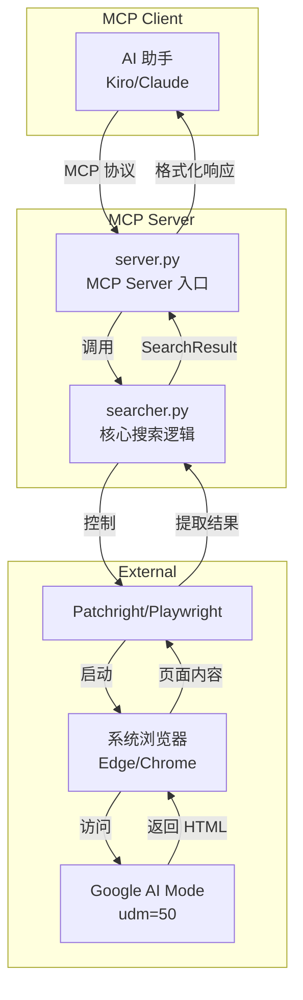
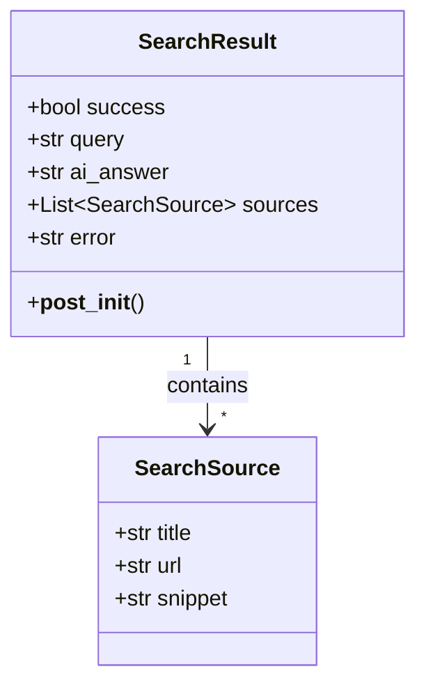
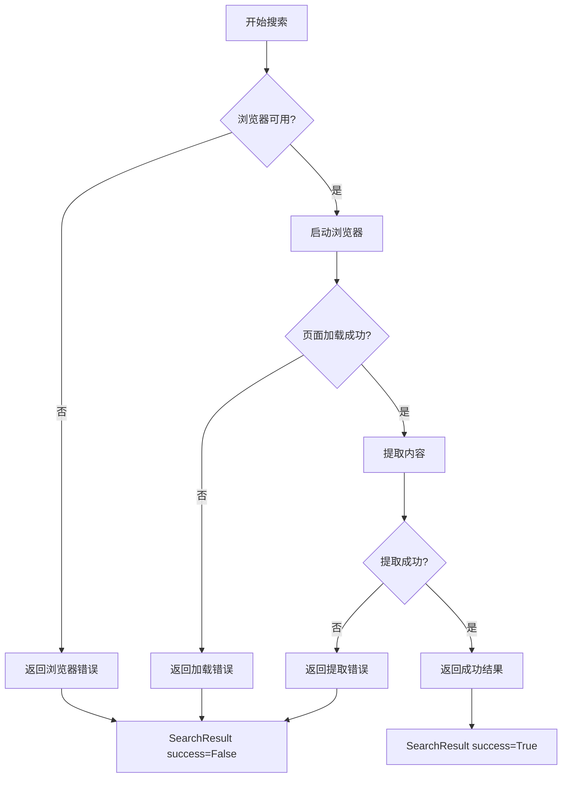

# 设计文档

## 概述

Google AI Search MCP Server 采用模块化设计，分为核心搜索逻辑（Searcher）和 MCP 服务器入口（Server）两个主要组件。系统使用 Patchright/Playwright 控制浏览器访问 Google AI 模式页面，提取 AI 回答和来源链接，并通过 MCP 协议暴露搜索工具。

## 架构



## 组件和接口

### 1. GoogleAISearcher 类

核心搜索逻辑组件，负责浏览器管理和搜索执行。

```python
class GoogleAISearcher:
    """Google AI 搜索器"""
    
    # 浏览器路径常量
    CHROME_PATHS: List[str]  # Chrome 可能的安装路径
    EDGE_PATHS: List[str]    # Edge 可能的安装路径
    
    def __init__(self, timeout: int = 30, headless: bool = True) -> None:
        """初始化搜索器
        
        Args:
            timeout: 页面加载超时时间（秒）
            headless: 是否无头模式
        """
        pass
    
    def _find_browser(self) -> Optional[str]:
        """查找可用的浏览器
        
        Returns:
            浏览器可执行文件路径，未找到返回 None
        """
        pass
    
    def search(self, query: str, language: str = "zh-CN") -> SearchResult:
        """执行 Google AI 搜索
        
        Args:
            query: 搜索关键词
            language: 语言代码
            
        Returns:
            SearchResult 包含 AI 回答和来源
        """
        pass
    
    def _extract_ai_answer(self, page) -> SearchResult:
        """从页面提取 AI 回答
        
        Args:
            page: Playwright Page 对象
            
        Returns:
            SearchResult
        """
        pass
```

### 2. MCP Server 模块

MCP 服务器入口，注册工具并处理调用。

```python
# server.py

server = Server("google-ai-search")
searcher = GoogleAISearcher()

@server.list_tools()
async def list_tools() -> list[Tool]:
    """列出可用的工具"""
    pass

@server.call_tool()
async def call_tool(name: str, arguments: dict[str, Any]) -> list[TextContent]:
    """执行工具调用"""
    pass

async def main():
    """主入口"""
    pass
```

### 3. 接口定义

#### 工具输入 Schema

```json
{
    "type": "object",
    "properties": {
        "query": {
            "type": "string",
            "description": "搜索关键词或问题"
        },
        "language": {
            "type": "string",
            "description": "语言代码，如 zh-CN（中文）、en-US（英文）",
            "default": "zh-CN"
        }
    },
    "required": ["query"]
}
```

#### 工具输出格式

成功时返回 Markdown 格式文本：

```markdown
## Google AI 搜索结果

**查询**: {query}

### AI 回答

{ai_answer}

### 来源 ({count} 个)

1. [{title}]({url})
2. ...
```

失败时返回错误信息：

```
搜索失败: {error}
```

## 数据模型



### SearchSource

```python
@dataclass
class SearchSource:
    """搜索来源"""
    title: str      # 来源标题
    url: str        # 来源 URL
    snippet: str = ""  # 摘要（可选）
```

### SearchResult

```python
@dataclass
class SearchResult:
    """搜索结果"""
    success: bool           # 是否成功
    query: str              # 查询词
    ai_answer: str = ""     # AI 回答
    sources: List[SearchSource] = None  # 来源列表
    error: str = ""         # 错误信息
    
    def __post_init__(self):
        if self.sources is None:
            self.sources = []
```

## 正确性属性

*正确性属性是指在系统所有有效执行中都应保持为真的特征或行为——本质上是关于系统应该做什么的形式化陈述。属性作为人类可读规范和机器可验证正确性保证之间的桥梁。*


### Property 1: URL 构造正确性

*对于任意* 查询词和语言参数，构造的 Google AI 模式 URL 都应包含 `udm=50` 参数和正确的 `hl` 语言参数，且查询词应被正确 URL 编码。

**验证: 需求 2.1, 2.5**

### Property 2: 文本清理正确性

*对于任意* 包含导航文本（如"AI 模式"、"搜索结果"、"登录"等）的原始文本，清理后的 AI 回答不应包含这些导航文本。

**验证: 需求 3.2**

### Property 3: 链接处理正确性

*对于任意* 从页面提取的链接列表，处理后的来源列表应满足：
- 不包含 google.com 域名的链接
- 不包含重复的 URL
- 数量不超过 10 个

**验证: 需求 3.3, 3.4, 3.5**

### Property 4: 输出格式正确性

*对于任意* 成功的 SearchResult，MCP Server 返回的格式化文本应包含查询词、AI 回答内容，以及所有来源链接的标题和 URL。

**验证: 需求 4.4**

### Property 5: SearchResult 默认初始化

*对于任意* 不提供 sources 参数的 SearchResult 初始化，sources 字段应为空列表而非 None。

**验证: 需求 5.3**

## 错误处理

### 错误类型和处理策略

| 错误场景 | 处理策略 | 返回内容 |
|---------|---------|---------|
| 未找到浏览器 | 返回失败的 SearchResult | error: "未找到可用的浏览器（Chrome 或 Edge）" |
| 页面加载超时 | 捕获异常，返回失败的 SearchResult | error: 包含超时信息 |
| 页面解析失败 | 捕获异常，返回失败的 SearchResult | error: "提取内容失败: {详细信息}" |
| query 参数为空 | 直接返回错误提示 | "错误: 请提供搜索关键词" |
| 未知工具名称 | 抛出 ValueError | "未知工具: {name}" |

### 异常处理流程



## 测试策略

### 单元测试

单元测试用于验证具体示例和边界情况：

1. **浏览器检测测试**
   - 测试 Edge 优先于 Chrome 的检测顺序
   - 测试无浏览器时的错误处理

2. **数据模型测试**
   - 测试 SearchSource 字段完整性
   - 测试 SearchResult 字段完整性
   - 测试 SearchResult 默认值初始化

3. **MCP Server 测试**
   - 测试工具注册正确性
   - 测试工具 schema 定义
   - 测试空 query 参数处理
   - 测试错误响应格式

### 属性测试

属性测试用于验证普遍性质，使用 `hypothesis` 库：

1. **URL 构造属性测试**
   - 生成随机查询词和语言参数
   - 验证 URL 包含必需参数
   - 最少 100 次迭代

2. **文本清理属性测试**
   - 生成包含导航文本的随机字符串
   - 验证清理后不包含导航文本
   - 最少 100 次迭代

3. **链接处理属性测试**
   - 生成随机链接列表（包含 Google 链接和重复链接）
   - 验证处理后满足所有约束
   - 最少 100 次迭代

4. **输出格式属性测试**
   - 生成随机 SearchResult
   - 验证格式化输出包含所有必需内容
   - 最少 100 次迭代

5. **默认初始化属性测试**
   - 生成不同参数组合的 SearchResult
   - 验证 sources 始终为列表
   - 最少 100 次迭代

### 测试配置

```python
# pytest.ini 或 pyproject.toml
[tool.pytest.ini_options]
testpaths = ["tests"]
asyncio_mode = "auto"

# hypothesis 配置
[tool.hypothesis]
max_examples = 100
```

### 测试标签格式

每个属性测试应包含注释标签：

```python
# Feature: google-ai-search-mcp, Property 1: URL 构造正确性
@given(query=st.text(min_size=1), language=st.sampled_from(["zh-CN", "en-US", "ja-JP"]))
def test_url_construction_property(query, language):
    ...
```
