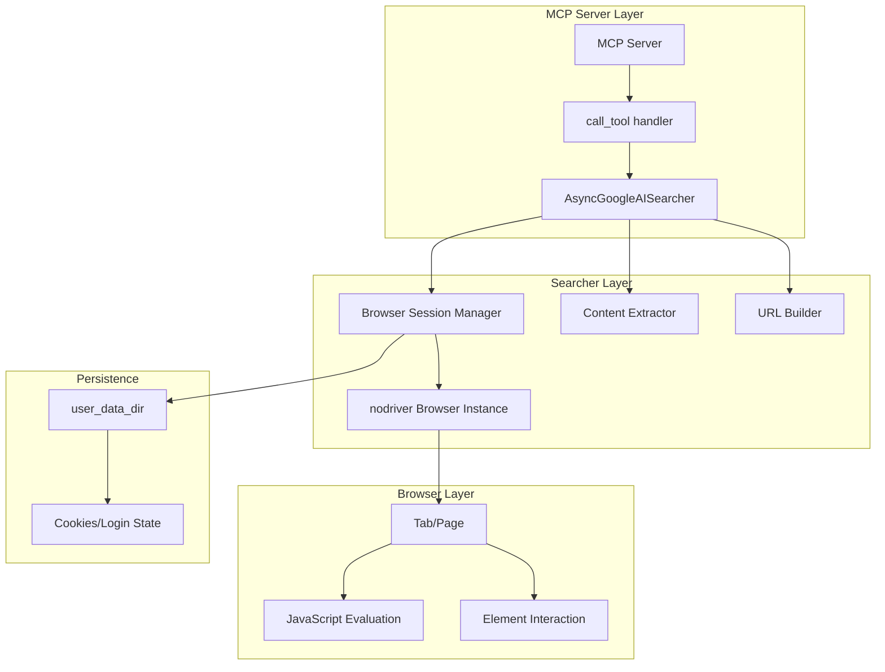

# Design Document: nodriver Migration

## Overview

This design document describes the migration of the Google AI Search MCP server from Patchright (Playwright fork) to nodriver browser automation library. The key architectural change is transitioning from synchronous Playwright API to nodriver's pure async API, which requires restructuring the searcher class and MCP server integration.

### Key Changes from Current Implementation

1. **Sync to Async**: Replace `sync_playwright()` with `await nodriver.start()`
2. **API Differences**: Adapt to nodriver's different element selection and interaction patterns
3. **Session Management**: Use nodriver's `user_data_dir` parameter for persistent sessions
4. **Resource Blocking**: Implement via nodriver's network interception capabilities
5. **Remove nest_asyncio**: No longer needed since nodriver is natively async

## Architecture



## Components and Interfaces

### 1. AsyncGoogleAISearcher Class

The main searcher class, now fully async.

```python
class AsyncGoogleAISearcher:
    """Async Google AI Searcher using nodriver
    
    Attributes:
        timeout: Page load timeout in seconds
        headless: Whether to run in headless mode (not recommended for nodriver)
        use_user_data: Whether to use persistent user data directory
    """
    
    def __init__(
        self,
        timeout: int = 30,
        headless: bool = False,  # nodriver recommends headed mode
        use_user_data: bool = True
    ) -> None: ...
    
    async def search(self, query: str, language: str = "zh-CN") -> SearchResult:
        """Execute a Google AI Mode search
        
        Args:
            query: Search query string
            language: Language code (zh-CN, en-US, etc.)
            
        Returns:
            SearchResult with AI answer and sources
        """
        ...
    
    async def continue_conversation(self, query: str) -> SearchResult:
        """Continue conversation in existing session (follow-up)
        
        Args:
            query: Follow-up query string
            
        Returns:
            SearchResult with incremental AI answer
        """
        ...
    
    async def close_session(self) -> None:
        """Close browser session and cleanup resources"""
        ...
    
    def has_active_session(self) -> bool:
        """Check if there's an active browser session"""
        ...
```

### 2. Browser Session Manager

Internal component managing nodriver browser lifecycle.

```python
class BrowserSessionManager:
    """Manages nodriver browser sessions
    
    Handles browser startup, tab management, and cleanup.
    Supports persistent sessions via user_data_dir.
    """
    
    async def start_session(self, language: str = "zh-CN") -> bool:
        """Start a new browser session
        
        Uses nodriver.start() with configuration:
        - user_data_dir for persistence
        - browser_executable_path for Edge/Chrome
        - locale for language setting
        """
        ...
    
    async def get_tab(self) -> Tab:
        """Get the current active tab"""
        ...
    
    async def close(self) -> None:
        """Close browser and cleanup"""
        ...
```

### 3. Content Extractor

Handles JavaScript-based content extraction.

```python
class ContentExtractor:
    """Extracts AI answers and sources from Google AI Mode pages
    
    Uses tab.evaluate() to run JavaScript for content extraction.
    """
    
    async def extract_ai_answer(self, tab: Tab) -> SearchResult:
        """Extract AI answer from current page
        
        Returns:
            SearchResult with ai_answer and sources
        """
        ...
    
    async def wait_for_streaming_complete(
        self, 
        tab: Tab, 
        max_wait_seconds: int = 30
    ) -> bool:
        """Wait for AI streaming output to complete
        
        Strategies:
        1. Check for loading indicators
        2. Monitor content length stability
        3. Detect follow-up input appearance
        """
        ...
```

### 4. MCP Server Integration

Updated server to work with async searcher directly.

```python
# server.py changes

# Remove nest_asyncio - no longer needed
# Remove ThreadPoolExecutor - no longer needed

# Global async searcher instance
searcher: Optional[AsyncGoogleAISearcher] = None

async def get_searcher() -> AsyncGoogleAISearcher:
    """Get or create the global searcher instance"""
    global searcher
    if searcher is None:
        searcher = AsyncGoogleAISearcher(
            headless=False,  # nodriver recommends headed
            use_user_data=True,
            timeout=60
        )
    return searcher

@server.call_tool()
async def call_tool(name: str, arguments: dict[str, Any]) -> list[TextContent]:
    """Execute tool call - now directly async"""
    searcher = await get_searcher()
    
    if follow_up and searcher.has_active_session():
        result = await searcher.continue_conversation(query)
    else:
        result = await searcher.search(query, language)
    
    return [TextContent(type="text", text=format_search_result(result))]
```

## Data Models

The data models remain unchanged from the current implementation:

```python
@dataclass
class SearchSource:
    """Search source link"""
    title: str
    url: str
    snippet: str = ""


@dataclass
class SearchResult:
    """Search result"""
    success: bool
    query: str
    ai_answer: str = ""
    sources: List[SearchSource] = field(default_factory=list)
    error: str = ""
```

## nodriver API Mapping

Key API differences between Patchright/Playwright and nodriver:

| Operation | Patchright/Playwright | nodriver |
|-----------|----------------------|----------|
| Start browser | `sync_playwright().start()` | `await nodriver.start()` |
| Navigate | `page.goto(url)` | `await tab.get(url)` |
| Wait for element | `page.wait_for_selector(sel)` | `await tab.wait_for(sel)` |
| Query element | `page.query_selector(sel)` | `await tab.query_selector(sel)` |
| Click element | `element.click()` | `await element.click()` |
| Fill input | `element.fill(text)` | `await element.send_keys(text)` |
| Evaluate JS | `page.evaluate(js)` | `await tab.evaluate(js)` |
| Get text | `element.text_content()` | `element.text` (property) |
| Close browser | `browser.close()` | `browser.stop()` |

## Key Implementation Details

### 1. Browser Startup with nodriver

```python
async def _start_browser(self, language: str) -> bool:
    """Start nodriver browser with configuration"""
    import nodriver as uc
    
    # Detect browser path
    browser_path = self._find_browser()
    
    # Configure browser options
    self._browser = await uc.start(
        user_data_dir=self._user_data_dir if self.use_user_data else None,
        browser_executable_path=browser_path,
        headless=self.headless,  # nodriver recommends False
        locale=language,
    )
    
    # Get the main tab
    self._tab = self._browser.main_tab
    
    return True
```

### 2. Element Waiting Strategy

nodriver's `wait_for` returns the element directly:

```python
async def _wait_for_ai_content(self, tab) -> bool:
    """Wait for AI content to load"""
    # Try multiple selectors
    for selector in self.AI_SELECTORS:
        try:
            element = await tab.wait_for(selector, timeout=2)
            if element:
                return True
        except Exception:
            continue
    
    # Fallback: check page content via JavaScript
    content = await tab.evaluate("document.body.innerText")
    return any(kw in content for kw in self.AI_KEYWORDS)
```

### 3. JavaScript Evaluation

nodriver uses the same `evaluate` pattern:

```python
async def _extract_content(self, tab) -> dict:
    """Extract content using JavaScript"""
    js_code = """
    () => {
        // Same extraction logic as current implementation
        const result = { aiAnswer: '', sources: [] };
        // ... extraction code ...
        return result;
    }
    """
    return await tab.evaluate(js_code)
```

### 4. Resource Blocking

nodriver supports network interception:

```python
async def _setup_resource_blocking(self, tab):
    """Block unnecessary resources"""
    # nodriver uses CDP for network interception
    await tab.send(
        "Network.setBlockedURLs",
        {"urls": [
            "*googleadservices.com*",
            "*googlesyndication.com*",
            "*doubleclick.net*",
            "*.png", "*.jpg", "*.gif", "*.webp",
            "*.woff", "*.woff2", "*.ttf",
        ]}
    )
```

### 5. Follow-Up Input Handling

```python
async def _submit_follow_up(self, tab, query: str) -> bool:
    """Submit follow-up query"""
    # Find follow-up input
    for selector in self.FOLLOW_UP_SELECTORS:
        try:
            element = await tab.query_selector(selector)
            if element:
                await element.click()
                await element.send_keys(query)
                await element.send_keys("\n")  # Submit
                return True
        except Exception:
            continue
    
    return False
```


## Correctness Properties

*A property is a characteristic or behavior that should hold true across all valid executions of a system—essentially, a formal statement about what the system should do. Properties serve as the bridge between human-readable specifications and machine-verifiable correctness guarantees.*

Based on the prework analysis, the following properties have been identified and consolidated:

### Property 1: URL Construction Correctness

*For any* valid query string and language code, the constructed Google AI Mode URL SHALL:
- Contain the `udm=50` parameter
- Contain the `hl` parameter with the specified language code
- Have the query properly URL-encoded
- When parsed, yield the original query string (round-trip)

**Validates: Requirements 3.1, 3.2, 3.3, 3.4**

### Property 2: SearchResult Serialization Round-Trip

*For any* valid SearchResult object, serializing to JSON then deserializing SHALL produce an equivalent object with identical success, query, ai_answer, sources, and error fields.

**Validates: Requirements 5.5**

### Property 3: Navigation Text Cleaning

*For any* extracted content containing navigation text patterns (in any supported language), the cleaning function SHALL remove all navigation patterns while preserving the AI answer content.

**Validates: Requirements 5.4**

### Property 4: Multi-Language Label Recognition

*For any* supported language code (zh-CN, en-US, ja-JP, ko-KR, de-DE, fr-FR), the extraction logic SHALL correctly recognize AI mode labels and navigation patterns in that language.

**Validates: Requirements 6.2, 6.3, 6.4**

### Property 5: Incremental Content Extraction

*For any* follow-up extraction where previous content exists, the result SHALL:
- Not contain the previous AI answer content
- Not contain the user's follow-up query at the start
- Contain only the new AI response

**Validates: Requirements 7.3, 7.5**

### Property 6: CAPTCHA Detection

*For any* page content containing known CAPTCHA keywords (in any supported language), the detection function SHALL return true.

**Validates: Requirements 8.5**

### Property 7: Proxy Preference Order

*For any* set of detected proxies, the selection SHALL prefer HTTP proxies over SOCKS5 proxies when both are available.

**Validates: Requirements 9.4**

### Property 8: Markdown Formatting Correctness

*For any* valid SearchResult object, the formatted Markdown output SHALL:
- Contain the query text
- Contain the AI answer (if present)
- Contain source links with proper Markdown link syntax
- When parsed, preserve the essential information (query, answer presence, source count)

**Validates: Requirements 11.4, 11.5**

### Property 9: Error Result Format

*For any* failed search operation, the returned SearchResult SHALL have success=False and a non-empty error message describing the failure.

**Validates: Requirements 12.2**

### Property 10: Browser Detection Priority

*For any* system with both Edge and Chrome installed, the browser detection SHALL select Edge as the preferred browser.

**Validates: Requirements 1.1**

### Property 11: Session Activity Tracking

*For any* search or follow-up operation, the session's last activity time SHALL be updated to reflect the operation time.

**Validates: Requirements 2.2**

## Error Handling

### Browser Errors

| Error Type | Handling Strategy |
|------------|-------------------|
| Browser not found | Return SearchResult with error, suggest installing Edge/Chrome |
| Browser startup failure | Log error, return SearchResult with error |
| user_data_dir locked | Attempt without persistence, or return error |

### Navigation Errors

| Error Type | Handling Strategy |
|------------|-------------------|
| Page load timeout | Return SearchResult with timeout error |
| Network error | Check proxy settings, retry once, then return error |
| CAPTCHA detected | Open visible browser for user intervention |

### Extraction Errors

| Error Type | Handling Strategy |
|------------|-------------------|
| No AI content found | Return SearchResult with empty ai_answer |
| JavaScript evaluation error | Log error, return SearchResult with error |
| Malformed content | Return partial content with warning |

### Session Errors

| Error Type | Handling Strategy |
|------------|-------------------|
| Session timeout | Close session, start new one on next request |
| Browser crash | Cleanup resources, return error |
| Follow-up input not found | Fall back to new search navigation |

## Testing Strategy

### Dual Testing Approach

This migration uses both unit tests and property-based tests for comprehensive coverage:

- **Unit tests**: Verify specific examples, edge cases, and error conditions
- **Property tests**: Verify universal properties across all inputs using Hypothesis

### Property-Based Testing Configuration

- **Library**: Hypothesis (already in dev dependencies)
- **Minimum iterations**: 100 per property test
- **Tag format**: `**Feature: nodriver-migration, Property {number}: {property_text}**`

### Test File Organization

| Test File | Properties Covered |
|-----------|-------------------|
| `tests/test_url.py` | Property 1 (URL Construction) |
| `tests/test_models.py` | Property 2 (SearchResult Round-Trip) |
| `tests/test_extraction.py` | Property 3, 4, 5 (Cleaning, Language, Incremental) |
| `tests/test_detection.py` | Property 6 (CAPTCHA Detection) |
| `tests/test_proxy.py` | Property 7 (Proxy Preference) |
| `tests/test_server.py` | Property 8 (Markdown Formatting) |
| `tests/test_searcher.py` | Property 9, 10, 11 (Error, Browser, Session) |

### Unit Test Focus Areas

- Edge cases for URL encoding (special characters, unicode)
- Error conditions (browser not found, timeout)
- Configuration options (headless, user_data_dir)
- Proxy detection with mocked ports

### Integration Test Considerations

Some requirements require integration testing with actual browser:
- Page navigation and content loading
- Follow-up input interaction
- CAPTCHA handling flow
- Resource blocking effectiveness

These should be tested manually or in a separate integration test suite.
