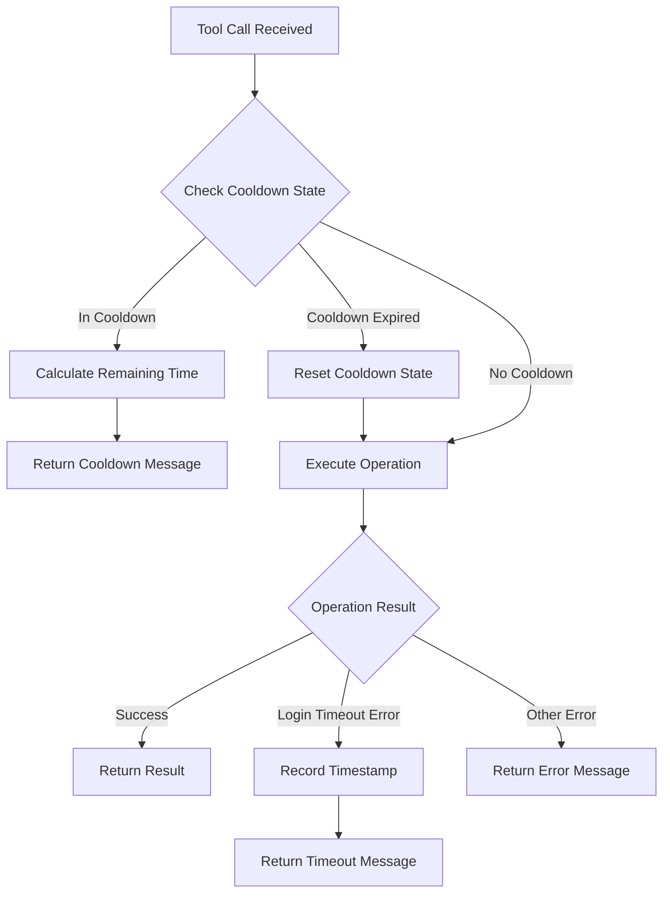

# Design Document: Patchright Login Cooldown

## Overview

This design implements a login timeout cooldown mechanism for the Patchright MCP server. The mechanism tracks when browser operations fail due to login/verification timeouts and prevents repeated operation attempts during a configurable cooldown period.

The design follows the existing pattern established in the google-ai-search MCP server, using module-level state variables and a time-based cooldown approach to handle the MCP protocol limitation where servers cannot detect conversation boundaries.

## Architecture



### State Management

The cooldown mechanism uses two module-level variables:
- `_login_timeout_timestamp`: Optional float storing the Unix timestamp of the last login timeout
- `_LOGIN_COOLDOWN_SECONDS`: Constant defining the cooldown duration (300 seconds)

### Flow Control

1. **Pre-operation Check**: Before executing any tool, check if in cooldown state
2. **Cooldown Evaluation**: If timestamp exists, calculate elapsed time
3. **State Transition**: Either return cooldown message or reset and proceed
4. **Post-operation Check**: After operation failure, detect login timeout errors
5. **State Recording**: Record timestamp when login timeout detected

## Components and Interfaces

### Module-Level State Variables

```python
# patchright-mcp/src/patchright_mcp/server.py

from typing import Optional
import time

# Login timeout cooldown mechanism
_login_timeout_timestamp: Optional[float] = None
_LOGIN_COOLDOWN_SECONDS = 300  # 5 minutes
```

### Login Timeout Detection Function

```python
def _is_login_timeout_error(error: str) -> bool:
    """Determine if an error indicates a login/verification timeout.
    
    Args:
        error: The error message string
        
    Returns:
        True if the error indicates a login timeout, False otherwise
    """
    timeout_keywords = [
        "验证超时",
        "登录超时", 
        "timeout",
        "captcha",
        "验证码",
        "login required",
        "authentication",
    ]
    error_lower = error.lower()
    return any(keyword.lower() in error_lower for keyword in timeout_keywords)
```

### Cooldown Check Function

```python
def _check_cooldown() -> Optional[TextContent]:
    """Check if server is in cooldown state and return message if so.
    
    Returns:
        TextContent with cooldown message if in cooldown, None otherwise
    """
    global _login_timeout_timestamp
    
    if _login_timeout_timestamp is None:
        return None
    
    elapsed = time.time() - _login_timeout_timestamp
    
    if elapsed < _LOGIN_COOLDOWN_SECONDS:
        remaining = int(_LOGIN_COOLDOWN_SECONDS - elapsed)
        remaining_min = remaining // 60
        remaining_sec = remaining % 60
        return TextContent(
            type="text",
            text=f"⏸️ Patchright 浏览器工具暂时不可用\n\n"
                 f"上次操作需要用户登录验证但超时未完成（可能用户不在电脑前）。\n"
                 f"冷却剩余: {remaining_min} 分 {remaining_sec} 秒\n\n"
                 f"**建议**: 如果这是新的对话，用户可能已经回来了，可以告知用户手动触发重试。\n"
                 f"或者使用其他工具（如 fetch MCP）作为替代。"
        )
    else:
        # Cooldown expired, reset state
        _login_timeout_timestamp = None
        return None
```

### Timeout Recording Function

```python
def _record_login_timeout() -> TextContent:
    """Record a login timeout and return notification message.
    
    Returns:
        TextContent with timeout notification message
    """
    global _login_timeout_timestamp
    _login_timeout_timestamp = time.time()
    
    return TextContent(
        type="text",
        text=f"⏸️ 操作需要用户验证但超时\n\n"
             f"该工具将暂停 {_LOGIN_COOLDOWN_SECONDS // 60} 分钟，避免重复打扰不在场的用户。\n"
             f"**注意**: 由于 MCP 协议限制，服务器无法检测对话边界。\n"
             f"如果用户开始新对话，可以建议用户等待冷却期结束或使用其他工具。"
    )
```

### Modified call_tool Function

```python
@server.call_tool()
async def call_tool(name: str, arguments: dict[str, Any]) -> list[TextContent | ImageContent]:
    """Execute tool call with cooldown check."""
    global _login_timeout_timestamp
    
    # Check cooldown state before any operation
    cooldown_msg = _check_cooldown()
    if cooldown_msg:
        return [cooldown_msg]
    
    loop = asyncio.get_running_loop()
    
    # ... existing tool dispatch logic ...
    
    # After getting result, check for login timeout
    if not result.success and _is_login_timeout_error(result.error):
        return [_record_login_timeout()]
    
    # ... rest of existing logic ...
```

## Data Models

### State Variables

| Variable | Type | Description |
|----------|------|-------------|
| `_login_timeout_timestamp` | `Optional[float]` | Unix timestamp of last login timeout, None if not in cooldown |
| `_LOGIN_COOLDOWN_SECONDS` | `int` | Cooldown duration in seconds (constant: 300) |

### Message Templates

| Message Type | Trigger | Content |
|--------------|---------|---------|
| Cooldown Message | Tool called during cooldown | Remaining time, explanation, alternatives |
| Timeout Message | Login timeout detected | Cooldown duration, MCP limitation note, suggestions |

## Correctness Properties

*A property is a characteristic or behavior that should hold true across all valid executions of a system—essentially, a formal statement about what the system should do. Properties serve as the bridge between human-readable specifications and machine-verifiable correctness guarantees.*

### Property 1: Login Timeout Keyword Detection

*For any* error string containing at least one of the login timeout keywords (timeout, 验证超时, 登录超时, captcha, 验证码, login required, authentication), the `_is_login_timeout_error` function SHALL return True.

**Validates: Requirements 1.2**

### Property 2: Non-Login Error Rejection

*For any* error string that does not contain any login timeout keywords, the `_is_login_timeout_error` function SHALL return False.

**Validates: Requirements 1.1, 1.2**

### Property 3: Timestamp Recording

*For any* call to `_record_login_timeout`, the `_login_timeout_timestamp` SHALL be set to a value within 1 second of the current time.

**Validates: Requirements 1.3**

### Property 4: Cooldown Message During Active Cooldown

*For any* timestamp set within the last `_LOGIN_COOLDOWN_SECONDS` seconds, the `_check_cooldown` function SHALL return a TextContent message (not None).

**Validates: Requirements 2.4, 3.1**

### Property 5: Cooldown Reset After Expiry

*For any* timestamp set more than `_LOGIN_COOLDOWN_SECONDS` seconds ago, after calling `_check_cooldown`, the `_login_timeout_timestamp` SHALL be None.

**Validates: Requirements 2.5, 4.1**

### Property 6: Remaining Time Accuracy

*For any* timestamp within the cooldown period, the remaining time displayed in the cooldown message SHALL equal `_LOGIN_COOLDOWN_SECONDS - elapsed_time` (within 1 second tolerance).

**Validates: Requirements 3.2**

### Property 7: Normal Operation After Reset

*For any* state where `_login_timeout_timestamp` is None, the `_check_cooldown` function SHALL return None, allowing normal operation to proceed.

**Validates: Requirements 4.2**


## Error Handling

### Error Classification

The system classifies errors into three categories:

1. **Login Timeout Errors**: Errors containing keywords indicating user verification was required but not completed. These trigger the cooldown mechanism.

2. **Other Browser Errors**: Standard browser operation failures (network errors, element not found, etc.). These are returned to the caller without triggering cooldown.

3. **Invalid Input Errors**: Missing or invalid arguments. These are handled before any browser operation and don't affect cooldown state.

### Edge Cases

| Scenario | Handling |
|----------|----------|
| Multiple rapid timeout errors | Only first sets timestamp; subsequent calls see cooldown message |
| Timestamp set to future (clock skew) | Elapsed time will be negative, treated as in-cooldown |
| Very old timestamp (> cooldown) | Reset on next check, normal operation proceeds |
| Concurrent tool calls | Module-level state is shared; all see same cooldown state |

### Error Message Localization

Error messages are in Chinese to match the existing codebase style and target user base. Key messages:
- Cooldown message: "⏸️ Patchright 浏览器工具暂时不可用"
- Timeout message: "⏸️ 操作需要用户验证但超时"

## Testing Strategy

### Unit Tests

Unit tests should cover:
- Keyword detection edge cases (case sensitivity, partial matches)
- Message content verification (required fields present)
- Configuration constant values

### Property-Based Tests

Property-based tests using Hypothesis should verify:
- **Property 1 & 2**: Error classification correctness across generated error strings
- **Property 3**: Timestamp recording accuracy
- **Property 4 & 5**: Cooldown state transitions based on time
- **Property 6**: Remaining time calculation accuracy
- **Property 7**: Normal operation when not in cooldown

### Test Configuration

- Use `hypothesis` library for property-based testing
- Minimum 100 iterations per property test
- Each test tagged with: `**Feature: patchright-login-cooldown, Property N: {property_text}**`

### Test File Structure

```
patchright-mcp/tests/
├── test_cooldown.py          # Cooldown mechanism tests
│   ├── test_is_login_timeout_error()     # Property 1, 2
│   ├── test_record_login_timeout()       # Property 3
│   ├── test_check_cooldown_active()      # Property 4
│   ├── test_check_cooldown_expired()     # Property 5
│   ├── test_remaining_time_accuracy()    # Property 6
│   └── test_check_cooldown_none()        # Property 7
```

### Mocking Strategy

- Use `time.time()` mocking to control timestamp values
- No browser mocking needed for cooldown logic tests (pure functions)
- Integration tests can verify end-to-end flow with actual browser operations
