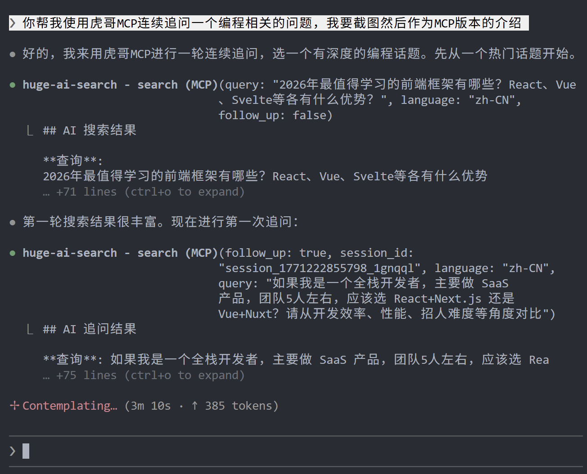
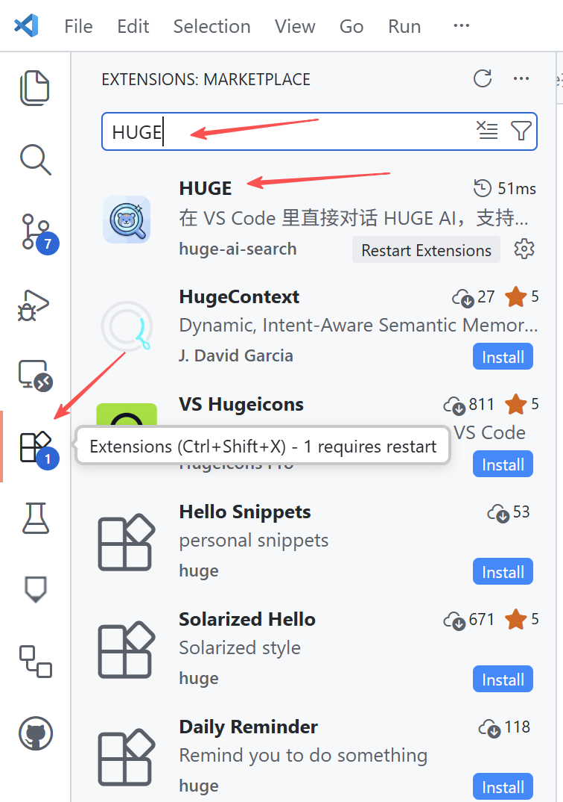
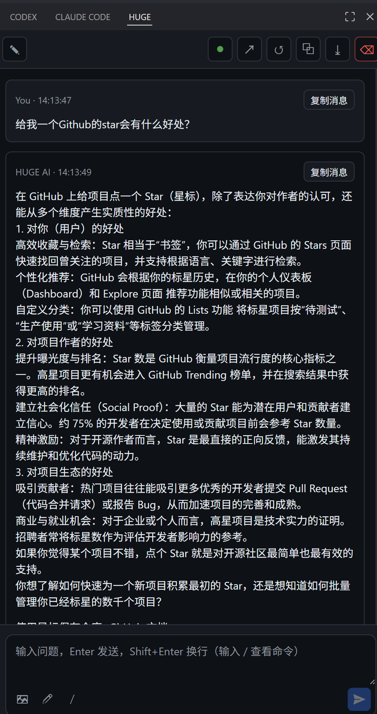

<p align="center">
  
</p>

<h1 align="center">Huge AI Search MCP Server</h1>

<p align="center">
  把 Google AI Mode 搜索接入到 Cursor、Claude Code、Codex 等客户端，支持连续追问与来源链接。
</p>

<p align="center">
  <a href="https://www.npmjs.com/package/huge-ai-search"></a>
  <a href="./LICENSE"></a>
</p>

## 版本说明（两部分）

<p align="center">
  <a href="#第一部分mcp-版"></a>
  <a href="#第二部分ide-插件版"></a>
</p>

### 1) MCP 版（本 README 主要内容）

- 面向 Cursor / Claude Code / Codex 等支持 MCP 的客户端
- 通过 `huge-ai-search` 工具调用联网搜索
- NPM：
  `https://www.npmjs.com/package/huge-ai-search`

### 2) IDE 插件版（兼容 VS Code 扩展生态）

- 扩展名：`hudawang.huge-ai-search`（显示名：HUGE）
- 可在支持 VS Code 扩展生态的 IDE 中使用（如 VS Code / Cursor / Windsurf 等）
- 可作为 MCP 之外的 IDE 内使用方式，也可结合你的现有工作流一起使用
- 插件文档：`extensions/huge-ai-chat/README.md`
- VS Code Marketplace：
  `https://marketplace.visualstudio.com/items?itemName=hudawang.huge-ai-search`

## 第一部分：MCP 版

<p align="left">
  
</p>

### 这是什么

- 让 AI 客户端直接调用 `huge-ai-search` 做联网搜索
- 返回 AI 总结结果 + 来源链接
- 支持同一会话连续追问（更深入）
- 支持文本 + 图片搜索（`image_path`）

### 使用前准备

1. 安装 Microsoft Edge（必需）
2. 首次使用建议先做一次登录验证：

```bash
npx -y -p huge-ai-search@latest huge-ai-search-setup
```

3. 中国大陆用户请配置代理（推荐设置 `HTTP_PROXY` / `HTTPS_PROXY` / `ALL_PROXY`）

### Installation

> [!NOTE]
> Windows 默认推荐：先全局安装 `npm i -g huge-ai-search`，配置里使用 `cmd /c huge-ai-search`。  
> 如需 npx，请写成 `cmd /c npx ...`，不要直接把 `command` 写成 `npx`。

<details>
<summary><b>Quick Install</b></summary>

免安装运行：

```bash
npx huge-ai-search
```

全局安装：

```bash
npm install -g huge-ai-search
```

</details>

<details>
<summary><b>Install in Cursor</b></summary>

配置文件：
- macOS / Linux: `~/.cursor/mcp.json`
- Windows: `%USERPROFILE%\\.cursor\\mcp.json`

macOS / Linux:

```json
{
  "mcpServers": {
    "huge-ai-search": {
      "command": "npx",
      "args": ["-y", "huge-ai-search@latest"]
    }
  }
}
```

Windows:

```json
{
  "mcpServers": {
    "huge-ai-search": {
      "command": "cmd",
      "args": ["/c", "huge-ai-search"]
    }
  }
}
```

</details>

<details>
<summary><b>Install in Claude Code</b></summary>

macOS / Linux:

```sh
claude mcp add huge-ai-search -- npx -y huge-ai-search@latest
```

Windows (PowerShell):

```powershell
claude mcp add-json huge-ai-search -s user '{"command":"cmd", "args":["/c", "huge-ai-search"]}'
```

Windows (CMD):

```cmd
claude mcp add-json huge-ai-search -s user "{\"command\":\"cmd\", \"args\":[\"/c\", \"huge-ai-search\"]}"
```

</details>

<details>
<summary><b>Install in Codex CLI</b></summary>

配置文件：`~/.codex/config.toml`

默认写法：

```toml
[mcp_servers.huge-ai-search]
command = "npx"
args = ["-y", "huge-ai-search@latest"]
```

Windows 推荐：

```toml
[mcp_servers.huge-ai-search]
type = "stdio"
command = "cmd"
args = ["/c", "huge-ai-search"]
startup_timeout_sec = 120
tool_timeout_sec = 180
```

</details>

<details>
<summary><b>Other IDEs and Clients (Use Cursor Template)</b></summary>

以下客户端直接复用 Cursor 的 JSON 模板，仅替换配置文件路径：

- Kiro: `~/.kiro/settings/mcp.json`（Windows: `%USERPROFILE%\\.kiro\\settings\\mcp.json`）
- Windsurf: `~/.codeium/windsurf/mcp_config.json`（Windows: `%APPDATA%\\Codeium\\Windsurf\\mcp_config.json`）
- Claude Desktop:  
  macOS `~/Library/Application Support/Claude/claude_desktop_config.json`  
  Windows `%APPDATA%\\Claude\\claude_desktop_config.json`
- VS Code (GitHub Copilot): 项目根目录 `.vscode/mcp.json`
- VS Code + Cline:  
  macOS `~/Library/Application Support/Code/User/globalStorage/saoudrizwan.claude-dev/settings/cline_mcp_settings.json`  
  Windows `%APPDATA%\\Code\\User\\globalStorage\\saoudrizwan.claude-dev\\settings\\cline_mcp_settings.json`

</details>

<details>
<summary><b>推荐提示词（搜索优先原则 · 深度追问通用版）</b></summary>

````markdown
# 搜索优先原则（深度追问通用版）

> **先知其不可为，方能有所为**

## 🚨 硬性规则

**每次代码修改前，必须调用 `mcp_huge_ai_search_search` 进行深度搜索**

- 不搜索就写代码 = 违规！
- 只搜一次不追问 = 浪费！
- 至少追问 2-3 次才算完成搜索！

## 🔥 核心工具：mcp_huge_ai_search_search

这是支持多轮追问的 AI 搜索工具，**必须进行深度追问**！

- 首次搜索返回 `session_id`
- 后续追问设置 `follow_up: true` + `session_id` 继续深入
- AI 会在上下文中持续回答，越问越深

## ⭐ 深度追问流程（必须遵循）

### 第一步：初次搜索
```
mcp_huge_ai_search_search({
  query: "{技术/问题} 是什么？核心概念和常见用法？",
  language: "zh-CN",
  follow_up: false
})
```
→ 获取 `session_id`

### 第二步：场景化追问（必追！）
```
mcp_huge_ai_search_search({
  query: "如果我的场景是 {具体场景}，应该怎么做？",
  session_id: "上一步返回的 session_id",
  follow_up: true
})
```

### 第三步：避坑追问（必追！）
```
mcp_huge_ai_search_search({
  query: "有哪些常见的坑和反模式需要避免？",
  session_id: "同一个 session_id",
  follow_up: true
})
```

### 第四步：最佳实践追问（推荐）
```
mcp_huge_ai_search_search({
  query: "有哪些推荐的最佳实践？",
  session_id: "同一个 session_id",
  follow_up: true
})
```

---

## 第一式：辨（明其性）

辨别请求之性质，决定行动路径：

| 请求类型 | 行动 |
|----------|------|
| 代码实现 / 架构设计 / 性能优化 | **必搜其坑 + 深度追问** |
| Bug 修复 | 走「捉虫三步」|
| 简单查询 / 文件操作 / 文档修改 | 可顺其自然 |
| 用户言「不搜索」或「直接做」| 从其意 |

---

## 🐛 捉虫三步（Bug 修复通用流程）

**第一步：搜（问道于网）**
使用 `mcp_huge_ai_search_search` 搜索并追问：
- 初次：「{错误信息} 常见原因和解决方案」
- 追问1：「在 {技术栈/框架} 环境下最可能是什么原因？」
- 追问2：「有哪些排查步骤和调试技巧？」

**第二步：查（问道于日志）**
查看日志文件定位问题：
- 关注：ERROR、WARNING、Exception、崩溃堆栈
- 若无相关日志 → 先添加调试日志，复现问题

**第三步：解（对症下药）**
根据搜索结果 + 日志信息，定位问题根因后修复。

---

## 🔧 常规开发流程

**第二式：避（知其不可为）**
使用 `mcp_huge_ai_search_search` 搜索避坑 + 深度追问：
- 初次：「{技术} 常见错误和反模式？」
- 追问1：「在我的场景（{具体场景}）下要注意什么？」
- 追问2：「有哪些最佳实践？」
- 追问3：「有哪些常见的坑需要避免？」

**第三式：记（铭其戒）**
简要总结需要避免的错误，作为实现的警示。

**第四式：行（顺势而为）**
知其不可为后，方可有所为。

---

## 追问策略模板

| 追问类型 | 示例查询 |
|----------|----------|
| **场景化** | 「如果我的场景是 {具体场景}，应该怎么做？」 |
| **细节深入** | 「刚才提到的 {某个点}，能详细说说吗？」 |
| **对比选型** | 「{方案A} 和 {方案B} 在我的场景下哪个更好？」 |
| **避坑** | 「这个方案有什么潜在的坑需要注意？」 |
| **最佳实践** | 「有哪些推荐的最佳实践？」 |

---

## 搜索触发条件

### ✅ 必须搜索 + 追问
- 修改任何代码文件
- 修复 bug
- 添加新功能
- 重构代码
- 遇到错误信息
- 性能优化
- 架构设计决策
- 技术选型

### ❌ 可跳过
- 纯文档修改（.md 文件）
- 简单配置文件修改
- 用户明确说「不搜索」或「直接做」
- 简单的文件操作（重命名、移动等）

---

## 金句

> 「搜而不追，等于白搜」

> 「宁可多追一次，不可少追一次」

> 「追问成本很低，踩坑代价很高」

> 「先知其不可为，方能有所为」
````

</details>

### 怎么用

### 基本搜索

直接让你的 AI 助手调用搜索工具，例如：

- “搜索一下 React 19 有什么新特性”
- “用英文搜索 TypeScript 5.0 new features”

### 连续追问（推荐）

先问概况，再追问细节/场景/避坑，效果最好：

1. 第一次：问整体方案  
2. 第二次：结合你的场景问怎么选  
3. 第三次：问常见坑和最佳实践

### 图片搜索

工具支持传 `image_path`（本地图片绝对路径）进行图文联合搜索。

### 工具参数

| 参数 | 必需 | 默认值 | 说明 |
|---|---|---|---|
| `query` | ✅ | - | 搜索问题（自然语言） |
| `language` | ❌ | `zh-CN` | 结果语言（`zh-CN`/`en-US`/`ja-JP`/`ko-KR`/`de-DE`/`fr-FR`） |
| `follow_up` | ❌ | `false` | 是否在当前会话中追问 |
| `session_id` | ❌ | 自动生成 | 会话 ID（用于多窗口独立追问） |
| `image_path` | ❌ | - | 本地图片绝对路径（单图） |

### 常见问题

### 1) 提示找不到 Edge

请先安装 Microsoft Edge。本工具仅支持 Edge 驱动流程。

### 2) Windows 下 `npx` 启动不稳定

改用：

- `command = "cmd"`
- `args = ["/c", "huge-ai-search"]`

或 npx 兼容写法：

- `command = "cmd"`
- `args = ["/c", "npx", "-y", "huge-ai-search@latest"]`

### 3) 需要登录/验证码怎么办

执行：

```bash
npx -y -p huge-ai-search@latest huge-ai-search-setup
```

按提示在浏览器完成登录/验证后关闭窗口即可。

### 4) 日志在哪

- Windows: `C:\\Users\\<用户名>\\.huge-ai-search\\logs\\`
- macOS: `/Users/<用户名>/.huge-ai-search/logs/`
- Linux: `/home/<用户名>/.huge-ai-search/logs/`

## 第二部分：IDE 插件版

在支持 VS Code 扩展生态的 IDE 中，可直接安装并在侧边栏使用：

<p align="left">
  
</p>

<p align="left">
  
</p>

### 适用范围

- 支持 VS Code 扩展生态的 IDE（如 VS Code / Cursor / Windsurf 等）
- 可作为 MCP 之外的 IDE 内使用方式，也可与你现有工作流结合使用

### 安装前准备

1. 安装 Node.js 18+（建议 LTS）
2. 确认终端命令可用：`node -v`、`npm -v`、`npx -v`
3. 确认 Microsoft Edge 可正常打开（登录与浏览器流程会用到）

### 3 分钟快速安装

1. 在扩展市场安装 **HUGE**（扩展 ID：`hudawang.huge-ai-search`）
2. 打开聊天入口（见下方“如何打开聊天入口”）
3. 首次按提示登录；也可点击右上角 `浏览器查看` 在浏览器完成登录
4. 发送一条测试消息，能收到回复即安装成功

Marketplace：
`https://marketplace.visualstudio.com/items?itemName=hudawang.huge-ai-search`

### 从零安装（详细）

1. 打开 IDE 的扩展市场，搜索并安装 `hudawang.huge-ai-search`
2. 安装后建议重启 IDE
3. 打开命令面板，执行 `HUGE: Open Chat`
4. 首次使用按提示完成登录
5. 如登录流程未拉起，执行 `HUGE: Run Login Setup`
6. 在聊天框发送测试问题（如 `hello`），确认可正常返回答案

### 如何打开 `HUGE: Open Chat`

#### 方式 A（推荐）：命令面板

1. 按 `Ctrl+Shift+P`（macOS: `Cmd+Shift+P`）
2. 输入 `HUGE`
3. 点击 `HUGE: Open Chat`

#### 方式 B（备用）：活动栏图标

1. 看 VS Code 左侧活动栏
2. 点击 **HUGE** 图标（插件安装后会出现）
3. 打开后即可进入聊天面板

#### 方式 C（备用）：编辑器标题按钮

1. 打开任意代码文件
2. 在编辑器右上角工具区找到 HUGE 图标/入口
3. 点击进入聊天

### 常见问题（插件版）

1. 命令不可用/服务启动失败  
   先检查 `node -v`、`npm -v`、`npx -v` 是否可用；Windows 可执行 `npm i -g huge-ai-search` 后重试。
2. 登录流程打不开  
   先点 `浏览器查看`，不行再执行 `HUGE: Run Login Setup`。
3. 网络错误或超时  
   检查代理环境变量：`HTTP_PROXY` / `HTTPS_PROXY` / `ALL_PROXY`，必要时换网络后重试。

### 主要命令

- `HUGE: Open Chat`
- `HUGE: New Thread`
- `HUGE: Run Login Setup`
- `HUGE: Clear History`
- `发送到 Huge`

### 详细插件文档

- `extensions/huge-ai-chat/README.md`

## License

MIT
